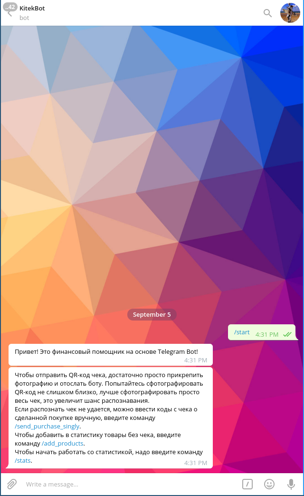
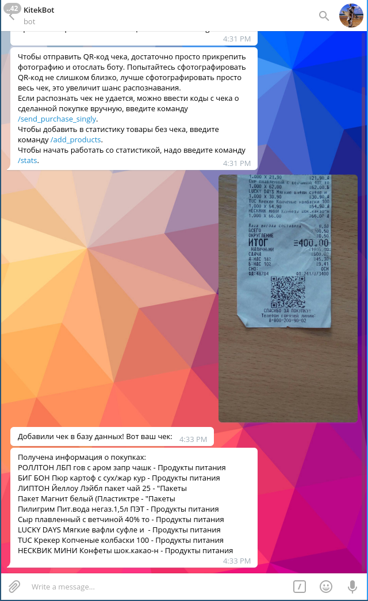
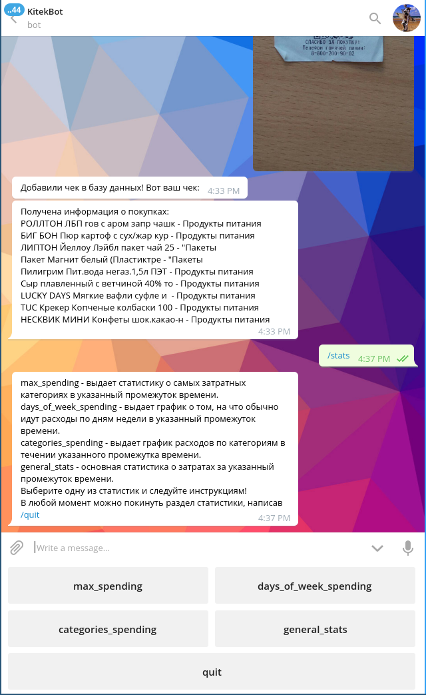
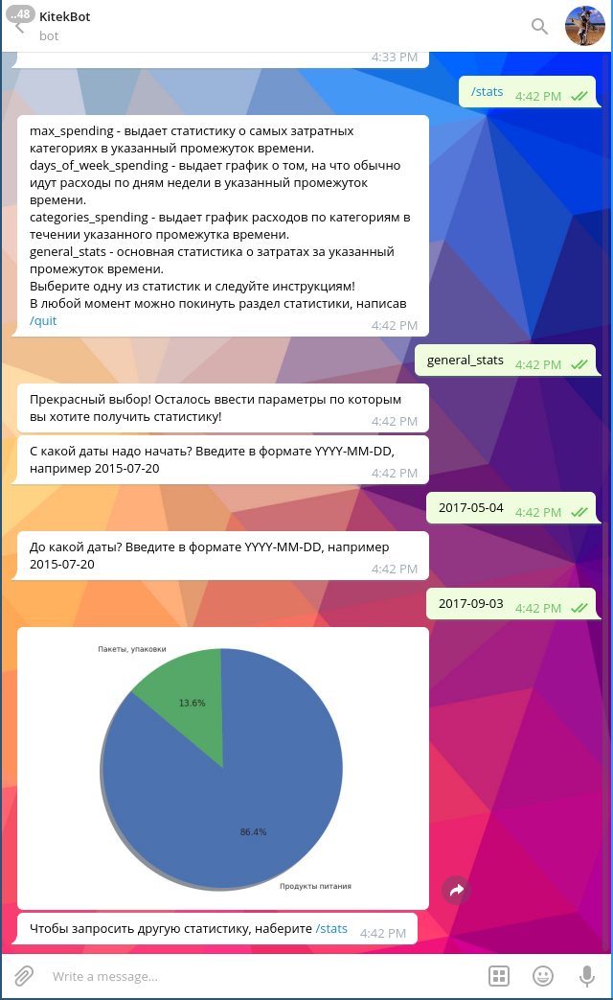
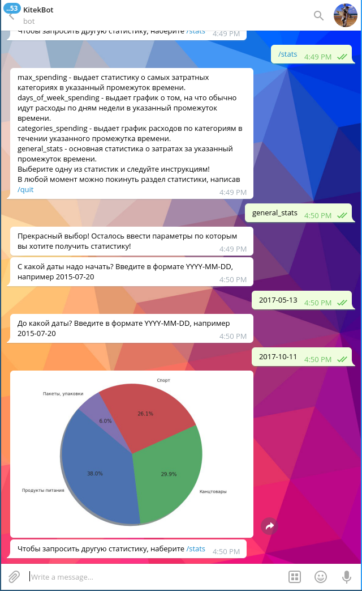
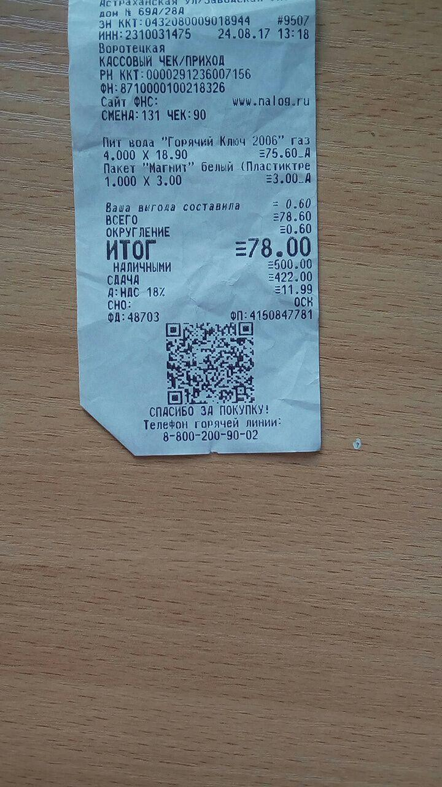
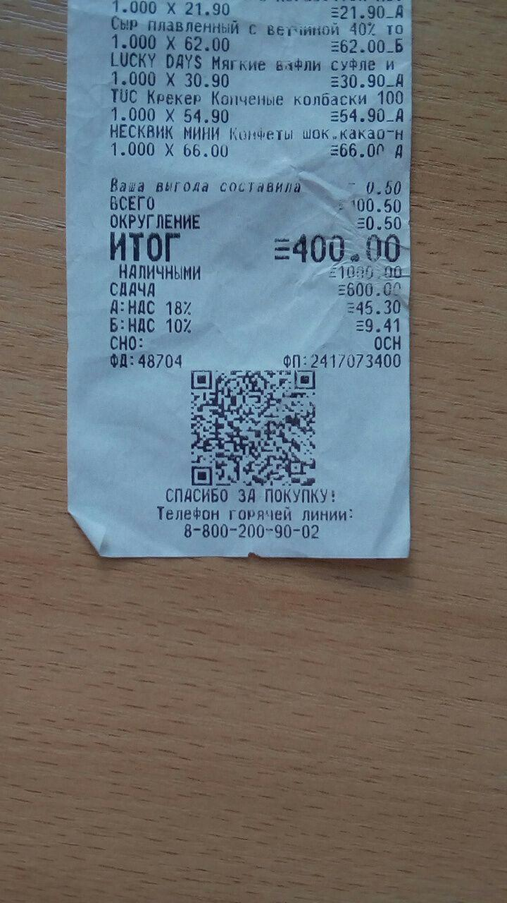
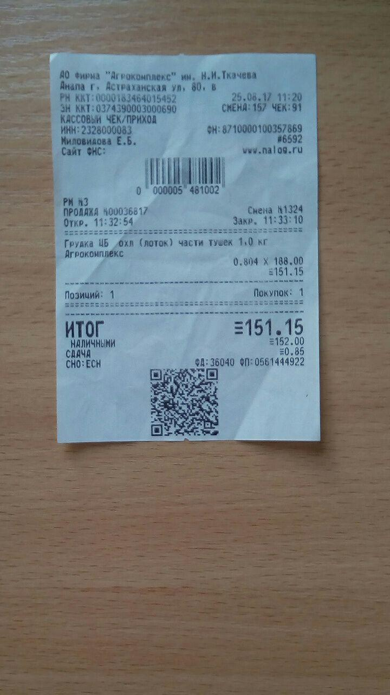

# Команда KiTeK 

## Финансовый помощник ведения расходов с чеков

**Introduction**. Учет трат -- важная часть многих финансовых приложений, ведь деньги любят счет. Оптимизация расходов -- 
такой же источник прибыли, как и заработок. Но как сейчас человек может сохранять информацию о своих 
покупках? Используя мобильные устройства, можно удобно мониторить траты с карточки -- смс оповещения
есть сейчас почти у всех банков. Более того, многие приложения банков умеют выводить красивую статистику
о потраченных с карточки деньгах. Но нельзя не согласиться, что такой способ учета подходит далеко не для
всех -- оплата наличными до сих пор играет большую роль. Наша команда придумала столь же удобный
способ для учета трат при наличном расчете. 

**Qr codes**. Согласно [Федеральному закону № 54-ФЗ](https://www.nalog.ru/rn33/news/activities_fts/6545208/), 
на всех чеках будет печататься [qr код](https://ru.wikipedia.org/wiki/QR-%D0%BA%D0%BE%D0%B4), используя который можно
получить информацию о покупках в чеке.
Мы написали бота для телеграма [KitekBot](https://t.me/kitekbot), который будет по фотографиям чеков с qr кодом
собирать и анализировать траты с использованием наличных средств. Теперь подробнее о том, что мы написали и о том, как это 
работает:
* Есть бот в телеграме `KitekBot`. Ему можно отправлять фотографии, на которых он ищет qr код и считывает с него данные. 
* В самом qr коде информации о покупках нет, но, используя данные, закодированные на чеке, мы формируем запрос 
к `api` федеральной налоговой службы. В ответе на запрос содержится список покупок, сделанных пользователем.
* Кажется, что этим можно и ограничиться, но здесь находится одна из самых сложных частей 
программы -- каждая покупка из списка, используя машинное обучение, определяется в один из классов покупок 
(для того, чтобы затем отображать статистику по классам). 
* Данные о покупках и их ценах сохраняются на сервере. Они хранятся отдельно для каждого пользователя.

**Statistics**. Также мы написали генерацию статистики по собранным данным. Послав боту одну из команд 
для показа статистики, в ответ он пришлет графики трат пользователя. 

**Advantages**. Хотелось бы перечислить преимущества нашего проекта:
* Так как закон, внедряющий qr коды на чеки был принят совсем недавно, такие приложения еще не успели появиться и
наш бот -- первый в своем роде. 
* Мы потратили очень много усилий на внедрение современных алгоритмов в наш код -- машинное обучение успешно применяется
для анализа покупок.
* Бот весьма `user friendly` -- умеет генерировать отчеты о тратах, которые понятны и информативны.
* И, наконец, самое главное преимущество нашего проекта -- модульность. Все части кода полностью изолированы друг от
друга: бот, сервер, алгоритмы машинного обучения, генерация графиков для статистики. Это означает, что весь функционал
можно крайне легко перенести из бота в приложения как на `Android`, так и на `ios`. Этот функционал может быть встроен в 
приложения банков или реализован в виде отдельного приложения.

**Future plans**. Несмотря на то, что уже очень много сделано, у нас впереди много работы:
* Требуется улучшить алгоритм распознования qr кодов. Сейчас возможность распознования сильно зависит от 
качества фотографии и не все коды удается распознать. Когда мы будем писать приложение под Android или под ios, 
мы используем другую, более продвинутую библиотеку для распознования кодов: [Google Vision](https://developers.google.com/vision/android/barcodes-overview)

Примеры qr кодов, которые сгенерированы в соответствии с требованиями налоговой службы и которые наш бот точно хорошо распознает:

**References**. Полезные ссылки:
* Видео с презентацией нашего проекта: https://www.youtube.com/watch?v=11sjDjLjFVo&feature=youtu.be
* Ссылка на нашего бота: https://t.me/kitekbot

Состав нашей команды **KiTeK**:
* Октай Татанов
* Артем Шалагин
* Михаил Юрлов
* Демид Зайцев
* Александр Тукалло
